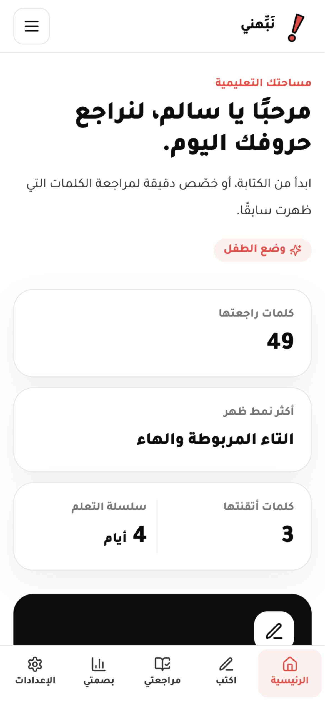
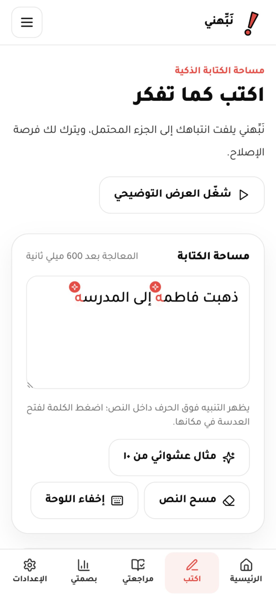
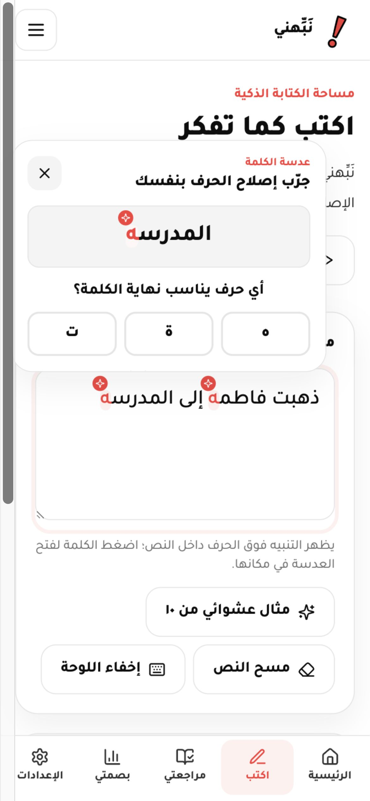
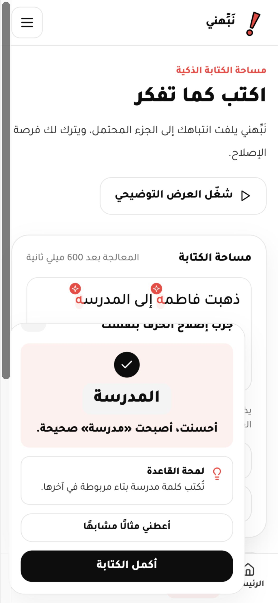
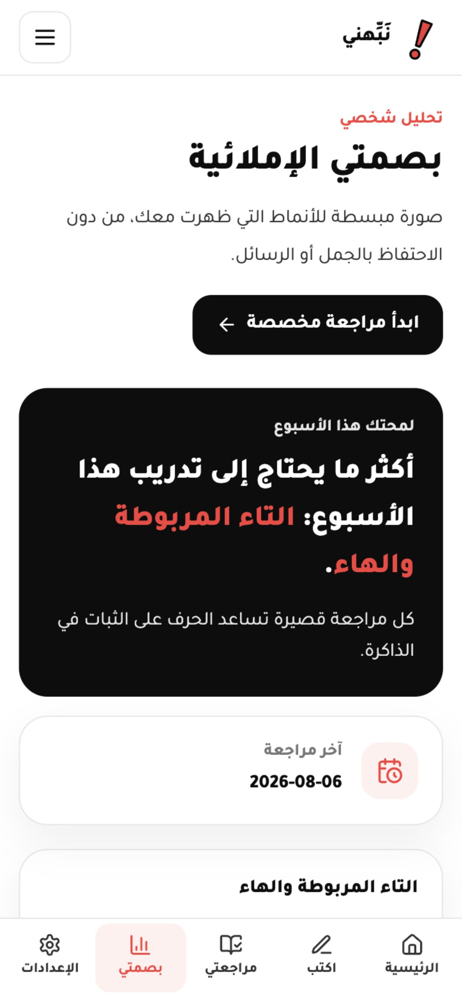
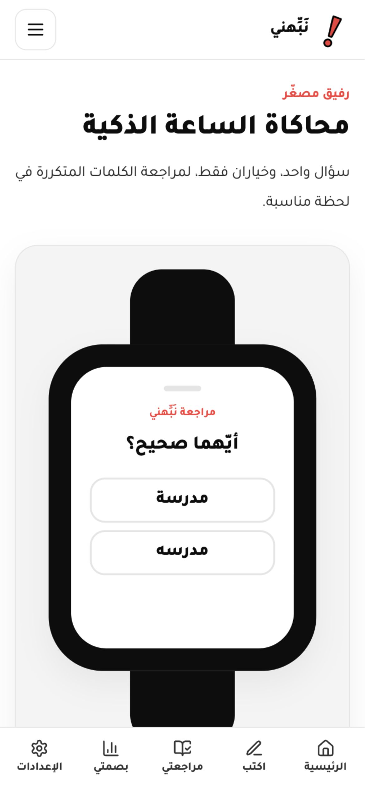
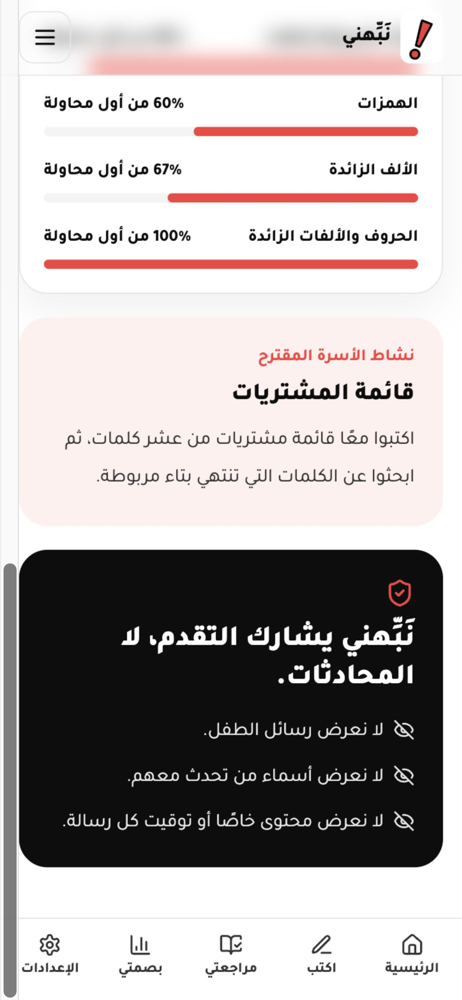

# نَبِّهني

## لأن كل حرف يفرق

**Smart Arabic | Developed Project | University Students**

**Developed by: حياد خلدون الحريري**

نَبِّهني نموذج أولي تفاعلي لمنظومة تعليمية عربية تساعد المستخدم على تحسين الإملاء أثناء الكتابة. لا يكتفي المشروع بعرض الصواب، بل يلفت الانتباه إلى الحرف الذي يحتاج إلى مراجعة، ويمنح المستخدم فرصة للمحاولة، ثم يشرح القاعدة ويسجل نمط الخطأ ضمن بصمته الإملائية الشخصية.

يغطي النموذج الأولي مجموعة مختارة من الأخطاء الإملائية الشائعة لإثبات تجربة الفكرة، وتتم المعالجة محليًا داخل المتصفح دون خادم خلفي أو خدمات مدفوعة.

## المشكلة

تعتمد أدوات التدقيق التقليدية غالبًا على خط أحمر أو تصحيح تلقائي يمنح المستخدم الإجابة مباشرة. قد تُصحح الكلمة في اللحظة نفسها، لكن ذلك لا يضمن فهم سبب الخطأ أو تذكّر الصواب لاحقًا.

## الحل

يستبدل نَبِّهني أسلوب التصحيح المباشر بتجربة تعليمية قصيرة ومشجعة:

1. يكتب المستخدم جملته بصورة طبيعية.
2. يحلل النظام النص محليًا بعد توقف قصير عن الكتابة.
3. ينبض الحرف أو الجزء المحتمل خطؤه دون استخدام خط أحمر.
4. يحاول المستخدم إصلاح الكلمة بنفسه من خلال خيارات محدودة.
5. يظهر الصواب مع شرح مبسط للقاعدة ومثال مشابه.
6. يُحفظ التقدم التعليمي فقط لتخصيص المراجعات اللاحقة.

## نبضة الحرف

تظهر النبضة على الحرف نفسه داخل مساحة الكتابة، مع هالة خفيفة ومؤشر بصري لا يعتمد على اللون وحده. تتوقف الحركة بعد عدد محدود من النبضات، وتحترم إعداد تقليل الحركة في الجهاز.

## التصحيح بالمحاولة

لا يغيّر التطبيق النص تلقائيًا ولا يكشف الحل الكامل مباشرة. عند الضغط على الحرف تظهر «عدسة الكلمة» قرب موضعه، ويختار المستخدم الحرف المناسب أو ينفذ التفاعل المطلوب. بعد المحاولة الصحيحة تظهر الكلمة المصححة والقاعدة التعليمية باختصار.

## البصمة الإملائية الشخصية

يتتبع النموذج أنواع الأخطاء التعليمية، وعدد المحاولات، والتصحيحات الصحيحة، والكلمات المتكررة، ومستوى الإتقان. تساعد هذه البيانات المستخدم على معرفة أكثر القواعد التي تحتاج إلى تدريب، مثل التاء المربوطة والهمزات والألف المقصورة.

## المراجعات الشخصية

تتكون المراجعة اليومية من جلسة قصيرة مبنية على الكلمات التي ظهرت سابقًا. تتنوع التفاعلات بين اختيار الحرف الصحيح، وحذف حرف زائد، وإضافة حرف ناقص، واختيار الصيغة الصحيحة. تُعد الكلمة متقنة بعد تكرار الإجابة الصحيحة في جلسات مختلفة وفق قاعدة النموذج التجريبية.

## محاكاة الساعة الذكية

يتضمن المشروع محاكاة بصرية لساعة ذكية تقدم سؤالًا قصيرًا وخيارين فقط. هذه المحاكاة جزء من النموذج الأولي وليست تطبيق ساعة حقيقيًا. تستقبل المراجعة نوع الكلمة التعليمية فقط، ولا تقرأ الرسائل أو المحادثات.

## لوحة الأسرة والخصوصية

تعرض لوحة الأسرة إحصاءات تعليمية مثل عدد الكلمات التي تمت مراجعتها، وأنواع الأخطاء، ومستوى التحسن، ونشاط عائلي مقترح. لا تعرض اللوحة الرسائل الأصلية أو النصوص الخاصة أو أسماء الأشخاص. نَبِّهني يشارك التقدم، لا المحادثات.

## النظام الذكي وخطة تطوير الذكاء الاصطناعي

يعتمد النموذج الحالي على نظام قواعد محلي وقاعدة بيانات قابلة للتوسعة للأخطاء الشائعة. يمكن تطوير المنظومة مستقبلًا باستخدام الذكاء الاصطناعي لفهم سياق الجملة بصورة أعمق، وتحسين تخصيص التلميحات والمراجعات، مع الحفاظ على الخصوصية وتقليل تخزين النصوص إلى الحد الأدنى.

## لقطات من التطبيق

| الصفحة الرئيسية | نبضة الحرف | عدسة الكلمة |
| --- | --- | --- |
|  |  |  |

| نجاح التصحيح | البصمة الإملائية | محاكاة الساعة |
| --- | --- | --- |
|  |  |  |

### لوحة الأسرة



## التقنيات المستخدمة فعليًا

- React لبناء الواجهة.
- TypeScript للتحقق من الأنواع وتنظيم الكود.
- Vite للتطوير والبناء.
- Tailwind CSS للتصميم المتجاوب والهوية البصرية.
- Framer Motion للحركات الخفيفة وانتقالات الصفحات.
- Lucide React للأيقونات.
- localStorage لحفظ التقدم التجريبي محليًا.
- Vitest وTesting Library للاختبارات الأساسية.
- قاعدة بيانات محلية ونظام اكتشاف قائم على القواعد، دون Backend أو API خارجي.

## تشغيل المشروع

يتطلب المشروع إصدارًا حديثًا من Node.js وnpm.

```bash
npm install
npm run dev
```

بعد تشغيل الأمر سيعرض Vite العنوان المحلي في نافذة الأوامر. افتحه في المتصفح لتجربة التطبيق.

## بناء نسخة الإنتاج

```bash
npm run build
```

ينشئ الأمر مجلد `dist` محليًا. هذا المجلد غير مرفوع إلى المستودع لأنه ناتج بناء ويمكن إنشاؤه في أي وقت.

## الاختبارات والفحص

```bash
npm run test
npm run typecheck
npm run lint
```

## بنية المشروع

```text
src/
  components/   مكونات الواجهة القابلة لإعادة الاستخدام
  data/         قاعدة الأخطاء والأمثلة المحلية
  hooks/        حالة التطبيق والتقدم المحلي
  pages/        صفحات التطبيق
  styles/       أنماط الهوية وRTL
  types/        تعريفات TypeScript
  utils/        الاكتشاف والتخزين والصوت
public/
  assets/       شعار نَبِّهني وأصوله البصرية
docs/
  screenshots/  لقطات أصلية عالية الدقة من التطبيق
```

## حدود النموذج الأولي

- يغطي مجموعة مختارة من الأخطاء الشائعة ولا يدّعي تدقيق اللغة العربية كاملة.
- لوحة المفاتيح والساعة الذكية محاكاتان داخل تطبيق الويب.
- لا يوجد خادم خلفي أو حسابات حقيقية أو مزامنة بين الأجهزة.
- لا تُحفظ الجمل الكاملة بعد الجلسة؛ يُحفظ التقدم التعليمي الضروري فقط محليًا.

